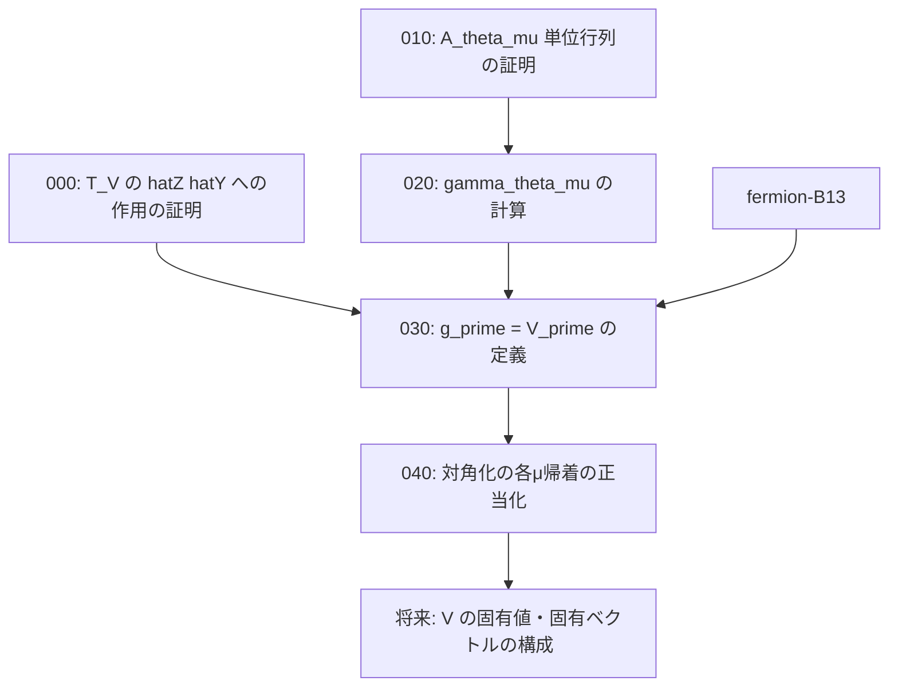

# Task Dependency Graph

## 概要

- **スコープ**: T\_V-diagonalization
- **タイトル**: T\_V の作用の証明完成と対角化の次ステップ
- **概要**: T\_V の hatZ, hatY への作用の式変形による証明、A(theta\_mu) が単位行列になる場合の証明、gamma\_{theta\_mu} の具体的な値の計算、g' = V' の表式定義と T\_V = T\_{V'} の証明、V の対角化の各μ帰着の正当化

## 依存状況

- 008/016\_definition\_A\_theta: **完了** — A(theta) の定義済み
- 008/026\_claim\_A\_thetaの対角化: **完了** — 固有値・固有ベクトル計算済み
- 008/027\_claim\_P\_muとD\_mu: **完了** — 対角化済み
- 008/029\_definition\_フェルミオン: **完了** — ψ\_μ†, ψ\_μ 定義済み
- 008/030\_claim\_Vとpsiの交換関係: **完了** — T\_(V)(ψ) の計算済み
- fermion-B13 スコープ: **WIP** — a(θ\_μ) の γ 表式、ψ の反交換関係が進行中

## 依存関係図

## タスク一覧

| #   | ファイル                                | カテゴリ | 概要                                              | 依存先       | 並列可否 |
| --- | --------------------------------------- | -------- | ------------------------------------------------- | ------------ | -------- |
| 000 | 000_T_V_hatZ_hatY_action_proof.md       | proof    | T\_V の hatZ,hatY への作用の式変形による証明        | なし         | 可       |
| 010 | 010_A_theta_identity_matrix.md          | proof    | γ₂(θ\_μ)=0 のとき A(θ\_μ) が単位行列になる証明    | なし         | 可       |
| 020 | 020_gamma_theta_mu_calculation.md       | proof    | γ\_{θ\_μ} の具体的な値の計算                      | 010          | 不可     |
| 030 | 030_V_prime_definition_T_V_eq.md        | proof    | g'=V' の表式定義と T\_V = T\_{V'} の証明           | 000, 020, fermion-B13 | 不可 |
| 040 | 040_diagonalization_mu_reduction.md     | proof    | 対角化の各μ帰着の正当化                            | 030          | 不可     |
