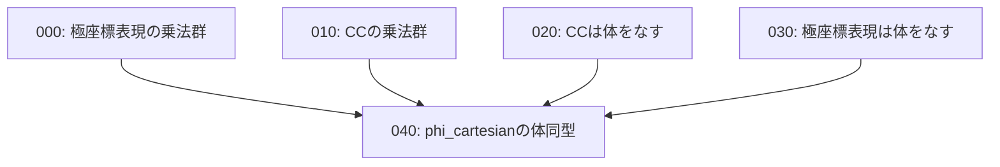

# Task Dependency Graph

## 概要

- **スコープ**: algebra-foundations
- **タイトル**: 計算公式の代数構造（体・乗法群・同型）の証明
- **概要**: `parts/000_計算公式/` にある代数構造に関する `#proof[TODO]` を完成させる。極座標表現とCCが体・乗法群をなすこと、phi\_cartesian が体の同型であることの証明。

## 依存状況

- 021\_definition\_極座標表現の演算: **完了** — 極座標表現の演算が定義済み
- 006\_definition\_CCの定義: **完了** — CC の定義済み
- 026\_definition\_極座標表現のCCへの写像\_phi\_polar: **完了** — phi\_polar 定義済み
- 027\_definition\_CCの極座標表現への写像\_phi\_cartesian: **完了** — phi\_cartesian 定義済み

## 依存関係図

## タスク一覧

| #   | ファイル                                | カテゴリ | 概要                                   | 依存先       | 並列可否 |
| --- | --------------------------------------- | -------- | -------------------------------------- | ------------ | -------- |
| 000 | 000_polar_multiplicative_group.md       | proof    | 極座標表現が乗法群をなすことの証明       | なし         | 可       |
| 010 | 010_CC_multiplicative_group.md          | proof    | CC が乗法群をなすことの証明              | なし         | 可       |
| 020 | 020_CC_is_field.md                      | proof    | CC が体をなすことの証明                  | なし         | 可       |
| 030 | 030_polar_is_field.md                   | proof    | 極座標表現が体をなすことの証明           | なし         | 可       |
| 040 | 040_phi_cartesian_field_isomorphism.md  | proof    | phi\_cartesian が体の同型であることの証明 | 000,010,020,030 | 不可 |
