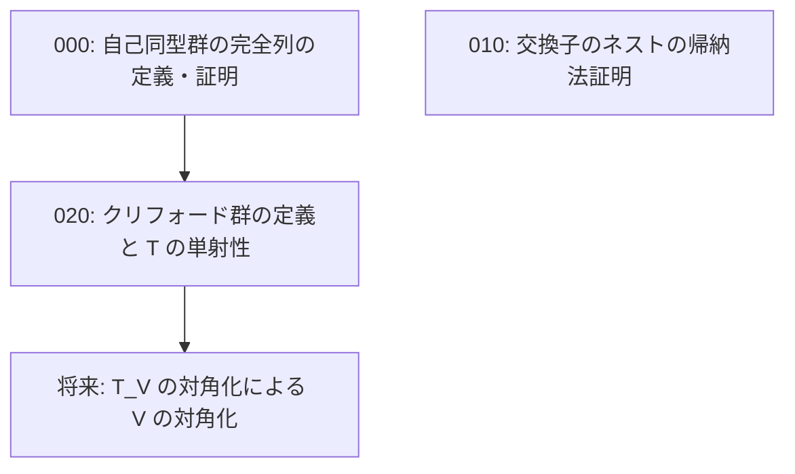

# Task Dependency Graph

## 概要

- **スコープ**: clifford-automorphism
- **タイトル**: クリフォード群・自己同型群の定義と交換子ネストの証明
- **概要**: クリフォード群の定義と T\_g の性質の整備、自己同型群の完全列に必要な定義と証明、交換子のネストの帰納法による証明を行う

## 依存状況

- 008/006\_definition\_自己同型群: **完了** — Aut, Inn, Out の定義済み
- 008/008\_definition\_環の乗法群: **完了** — 環の乗法群の定義済み
- 008/010\_definition\_T\_g: **完了** — T\_g の定義済み
- 008/001\_claim\_交換子のネスト (note 部分): **完了** — note に帰納法の方針あり

## 依存関係図

## タスク一覧

| #   | ファイル                                  | カテゴリ   | 概要                                        | 依存先 | 並列可否 |
| --- | ----------------------------------------- | ---------- | ------------------------------------------- | ------ | -------- |
| 000 | 000_automorphism_exact_sequence.md        | definition | 自己同型群の完全列: Ker/Im, Z(G), 完全列の定義と証明 | なし   | 可       |
| 010 | 010_commutator_nesting_induction.md       | proof      | 交換子のネストの帰納法による証明              | なし   | 可       |
| 020 | 020_clifford_group_T_injectivity.md       | definition | クリフォード群の定義と T の単射性             | 000    | 不可     |
