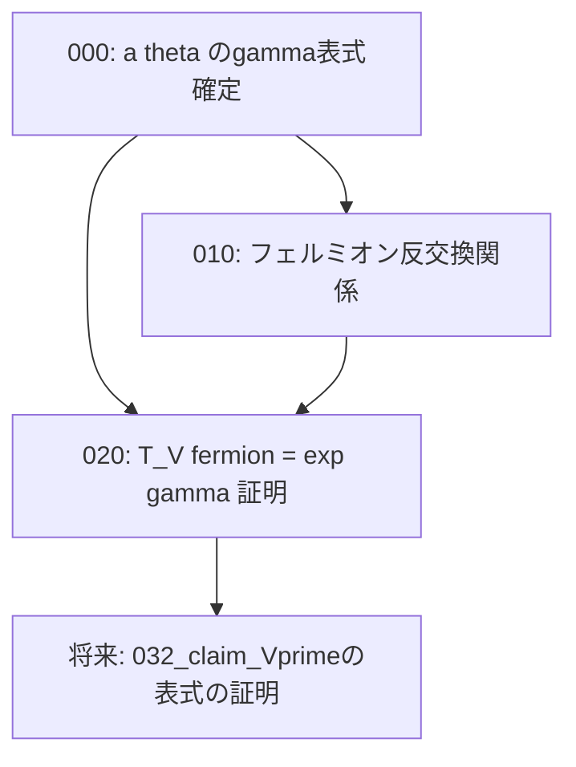

# Task Dependency Graph

## 概要

- **スコープ**: fermion-B13
- **タイトル**: フェルミオンの対角化とT_(V)の指数関数表式（ホロノミック量子場 付録B）
- **概要**: a(θ_μ)のγを使った表式確定、フェルミオン反交換関係の完成、T_(V)(ψ) = exp(±γ)ψ の証明を行い、V' = exp(-Σγ(ψ†ψ - 1/2)) の正当化に至る道筋を整備する

## 依存状況

- 030_claim_Vとpsiの交換関係: **完了** — T_(V)(ψ) = (γ₁ ± √(-γ₂γ₂(-)))ψ の証明済み
- 029_definition_フェルミオン: **完了** — ψ_μ†, ψ_μ の定義済み
- 027_claim_A_thetaの対角化_P_muとD_mu: **完了** — A(θ)の対角化済み
- 026_claim_A_thetaの対角化_固有値と固有ベクトル: **完了** — 固有値・固有ベクトル計算済み
- 007_hatZとhatYの反交換関係: **完了** — {Ẑ,Ẑ}₊, {Ẑ,Ŷ}₊, {Ŷ,Ŷ}₊ 証明済み
- 028_claim_a_theta_mu: **WIP** — i√(γ₂γ₂(-))/γ₂(-) の場合分け計算途中、α₁/α₂表式未完
- 031_claim_psiの反交換関係: **WIP** — パートa) 途中、パートb),c) 未着手

## 依存関係図

## タスク一覧

| #   | ファイル                             | カテゴリ | 概要                                              | 依存先 | 並列可否 |
| --- | ------------------------------------ | -------- | ------------------------------------------------- | ------ | -------- |
| 000 | 000_a_theta_gamma_expression.md      | proof    | a(θ_μ)のγを使った表式を確定する                    | なし   | 可       |
| 010 | 010_fermion_anticommutation.md       | proof    | フェルミオン同士の反交換関係 {ψ†,ψ†}₊=0 等を完成   | 000    | 一部可   |
| 020 | 020_T_V_fermion_exp_gamma.md         | proof    | T_(V)(ψ) = exp(±γ)ψ を証明する (B.13)             | 000,010 | 不可     |
