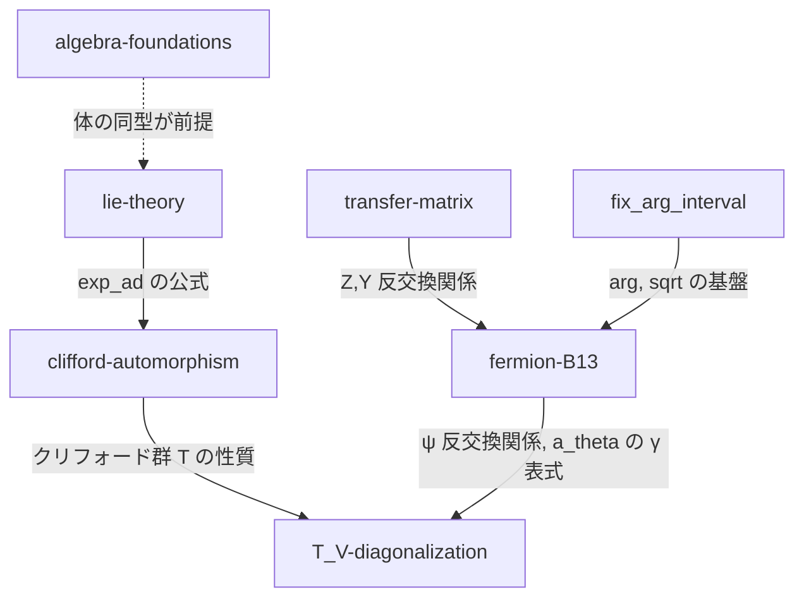

# TODO一覧 (main.typ以下)

main.typ およびそこから include されている .typ ファイル中の TODO を洗い出し、task-rules フォーマットで整理したもの。

---

## スコープ一覧

| スコープ | タスク数 | 概要 | ステータス |
|---|---|---|---|
| [algebra-foundations](algebra-foundations/) | 5 | 計算公式の代数構造（体・乗法群・同型）の証明 | 未着手 |
| [lie-theory](lie-theory/) | 7 | 線型写像のexp + Lie群/環の定義・証明 | 未着手 |
| [transfer-matrix](transfer-matrix/) | 6 | 転送行列の基礎証明 + Z,Y 反交換関係の残り | 未着手 |
| [clifford-automorphism](clifford-automorphism/) | 3 | クリフォード群・自己同型群・交換子ネスト | 未着手 |
| [T\_V-diagonalization](T_V-diagonalization/) | 5 | T\_V の作用の証明完成 + 対角化の次ステップ | 未着手 |
| [fermion-B13](fermion-B13/) | 3 | フェルミオン対角化と T\_(V) の指数関数表式 | WIP |
| [fix\_arg\_interval](fix_arg_interval/) | 21 | arg の区間を (-π,π] → [0,2π) に統一 | WIP |

**合計: 50 タスク** (7 スコープ)

---

## スコープ間の依存関係

---

## 既存スコープでカバー済みのTODO

以下は既存スコープの中で対応されている:

- **TODO-006** (038 sqrt展開の証明) → `fix_arg_interval/task_038_claim_CCのsqrtの極座標表現.md`
- **TODO-025** (031 psi反交換関係) → `fermion-B13/proof/010_fermion_anticommutation.md`

---

## 新規TODO

| # | 内容 | ファイル |
|---|---|---|
| TODO-031 | 034「det A(θ\_μ) = 1」の証明 → 完了（036 A(θ)の行列分解を経由） | `parts/008_.../034_claim_det_A_theta_mu.typ` |
| TODO-032 | 037「T\_(V')のψへの作用」の証明。V' ψ† V'^{-1} = e^γ ψ† を exp(ad) の公式と ψ の反交換関係から計算する | `parts/008_.../037_claim_T_Vprimeのpsiへの作用.typ` |
| TODO-033 | 038「T\_V = T\_(V')」の証明。030 + 033 の結果と 037 を合わせて T\_V = T\_(V') を示す | `parts/008_.../038_claim_T_V_eq_T_Vprime.typ` |
| TODO-034 | 039「V = cV'」の証明。T の単射性（クリフォード群の性質、009 TODO）を用いる | `parts/008_.../039_claim_V_eq_Vprime.typ` |

---

## インフラ系TODO（スコープ外）

| # | 内容 | ファイル |
|---|---|---|
| TODO-029 | BrianHall Prop 3.35 の証明概略をたどる | `main.typ:285` |
| TODO-030 | Typst の Bibliography 機能を導入する | `main.typ:289` |
