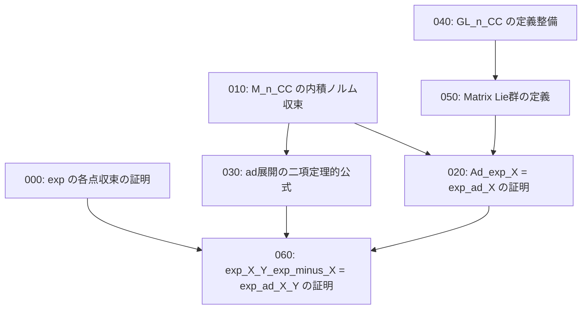

# Task Dependency Graph

## 概要

- **スコープ**: lie-theory
- **タイトル**: 線型写像のexp と Lie群/Lie環の定義・証明
- **概要**: 線型写像の exp の各点収束の証明、M(n,CC) の内積・ノルム・収束の定義、GL(n,CC) や Matrix Lie群の定義整備、ad 展開の二項定理的公式の証明、e^X Y e^{-X} = e^{ad(X)}(Y) (BrianHall Prop 3.35) の証明を行う

## 依存状況

- 003\_線型写像のexp/001\_definition: **完了** — exp の定義済み
- 005\_exp(ad)/000\_リー群リー環アプローチの概要: **完了** — Ad, ad の定義済み
- 005\_exp(ad)/006\_definition\_Ad\_g\_ad\_X: **完了** — Matrix Lie群上の Ad\_g, ad\_X 定義済み
- 005\_exp(ad)/007\_theorem\_exp(ad\_X)(Y)の級数展開: **完了** — 級数展開済み

## 依存関係図

## タスク一覧

| #   | ファイル                              | カテゴリ   | 概要                                       | 依存先   | 並列可否 |
| --- | ------------------------------------- | ---------- | ------------------------------------------ | -------- | -------- |
| 000 | 000_exp_convergence.md                | proof      | 線型写像の exp の級数の各点収束の証明         | なし     | 可       |
| 010 | 010_inner_product_norm_convergence.md | definition | M(n,CC) の内積・ノルム・収束の定義           | なし     | 可       |
| 020 | 020_Ad_exp_eq_exp_ad.md               | proof      | Ad(exp(X)) = exp(ad(X)) の証明              | 010, 050 | 不可     |
| 030 | 030_ad_binomial_formula.md            | proof      | ad 展開の二項定理的公式の証明                | 010      | 一部可   |
| 040 | 040_GL_n_CC_definition.md             | definition | GL(n,CC) の定義を2組で記述                   | なし     | 可       |
| 050 | 050_matrix_lie_group_definition.md    | definition | Matrix Lie群の定義の記述完成                 | 040      | 不可     |
| 060 | 060_exp_X_Y_exp_minus_X.md           | proof      | e^X Y e^{-X} = e^{ad(X)}(Y) の証明         | 000,020,030 | 不可  |
