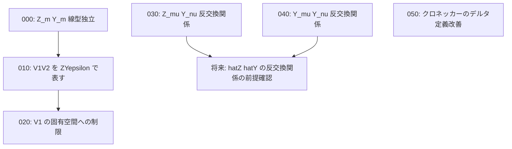

# Task Dependency Graph

## 概要

- **スコープ**: transfer-matrix
- **タイトル**: 転送行列の基礎証明と Z,Y 反交換関係の完成
- **概要**: 転送行列に関する基礎的な証明（Z\_m, Y\_m の線型独立性、V1V2 の Z,Y,epsilon 表式、V1 の固有空間制限）と、Z\_mu, Y\_nu の反交換関係の「同様」として省略された部分を完成させる

## 依存状況

- 004\_転送行列/000\_definition\_転送行列の記号の定義: **完了** — 記号の定義済み
- 004\_転送行列/003\_definition\_epsilon の固有空間: **完了** — 固有空間の定義済み
- 006\_ZとYの反交換関係/000\_claim (Z\_mu, Z\_nu の部分): **完了** — {Z\_mu, Z\_nu}\_+ の証明済み

## 依存関係図

## タスク一覧

| #   | ファイル                              | カテゴリ | 概要                                    | 依存先 | 並列可否 |
| --- | ------------------------------------- | -------- | --------------------------------------- | ------ | -------- |
| 000 | 000_Z_Y_linearly_independent.md       | proof    | Z\_m と Y\_m が線型独立であることの証明   | なし   | 可       |
| 010 | 010_V1V2_ZY_epsilon.md                | proof    | V1V2 を Z,Y,epsilon で表すことの証明      | 000    | 不可     |
| 020 | 020_V1_eigenspace_restriction.md      | proof    | V1 の固有空間への制限の証明               | 010    | 不可     |
| 030 | 030_Z_mu_Y_nu_anticommutator.md       | proof    | {Z\_mu, Y\_nu}\_+ の計算（「同様」の補完）| なし   | 可       |
| 040 | 040_Y_mu_Y_nu_anticommutator.md       | proof    | {Y\_mu, Y\_nu}\_+ の計算                 | なし   | 可       |
| 050 | 050_kronecker_delta_definition.md     | refactor | クロネッカーのデルタの定義記法の改善      | なし   | 可       |
